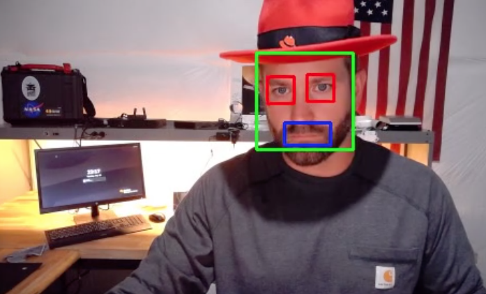

# Face, Mouth, Eyes Detection



Pretrained Haar Cascades with opencv
- Haar cascades introduced 2001
- Others are more accurate (HOG + linear SVM, SSDs, Faster R-CNN, YOLO)
- but..few are as fast and computation affordable (raspberry pi)
- prone to false positives
- great for edge (resource constrained devices)
- great for afforable solutions that can tolerate false positives, frontal images of face
- great for real-time
- cascades == stages
- can detect faces in images regardless of location or scale of face
- The [OpenCV library maintains a repository of pre-trained Haar cascades](https://github.com/opencv/opencv/tree/master/data/haarcascades). Most of these Haar cascades are used for either:
    - Face detection
    - Eye detection
    - Mouth detection
    - Full/partial body detection

Project structure
```angular2html
% tree .
.
├── Pipefile
├── README.md
├── cascades                                          # contains the pre-trained model code
│   ├── haarcascade_eye.xml                     # for detecting eyes
│   ├── haarcascade_frontalface_default.xml     # for detecting faces
│   └── haarcascade_smile.xml                   # for detecting mouths
├── main.ipynb                                        # uses a recorded video
├── opencv_haar_cascades.py                           # uses webcam stream
└── requirements.txt

```